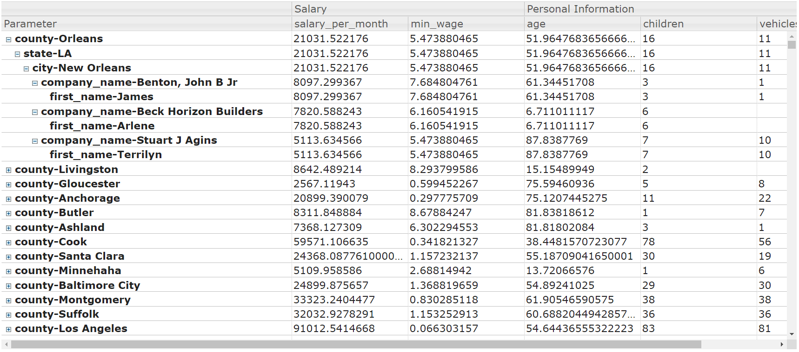

manyamSlickGrid
--------------
### SlickGrid based TreeView and Column Grouping
manyamSlickGrid born from SlickGrid TreeView combined with Column Grouping feature with advanced JSON processing, aggregations and automatic parent child relationship creation.

Why manyamSlickGrid exists - 
1. Ag-grid enterprise (a beautiful plugin in Javascript, Angular, and many more) is not open sourced and I could not find better plugin than SlickGrid with powerful features yet lot of additional work was needed to get the desired output.
2. Creating parent child relationship that SlickGrid's TreeView needed is time consuming and complex - 
    * Assigning parent array element index to child
    * Making sure child is always indexed below its parent
    * Assigning correct indentation to the rows
    * Creating unique ID

Don't worry it's all taken care of!



Getting started
--------------

#### Download
Download the zip file from GitHub and include it in your project.

#### Add all the required files
Refer index.html and refer all the required files into your HTML file.

#### Add a div element with id. This is where the grid is generated.
```html
<table width="100%">
  <tr>
      <div id="myGrid" style="width:90%;height:600px;"></div>
  </tr>
</table>
```
#### Initialize the plugin
```javascript
var manyamGrid = new ManyamSlickGrid('#myGrid');

var params = {}; // Paramters required for the plugin. Explained in Features section.
params['data'] = data; // Add data
```

#### Call generateTreeTable method on the object create the grid
```javascript
manyamGrid.generateTreeTable(params);
```
Features
--------------

Besides the standard set of features that SlickGrid provides for TreeView, manayamSlickGrid provides the following for TreeView - 

Consider employee JSON object with the following fields - 
* String fields - first_name, last_name, company_name, address, city, county, state, phone1, phone2, email, web
* Float fields - salary_per_month, min_wage, age (my bad that it's a float)
* Int fields - children, vehicles_owned
```json
[
    {
      "first_name": "James",
      "last_name": "Butt",
      "company_name": "Benton, John B Jr",
      "address": "6649 N Blue Gum St",
      "city": "New Orleans",
      "county": "Orleans",
      "state": "LA",
      "zip": 70116,
      "phone1": "504-621-8927",
      "phone2": "504-845-1427",
      "email": "jbutt@gmail.com",
      "web": "http://www.bentonjohnbjr.com",
      "salary_per_month": 8097.299367,
      "min_wage": 7.684804761,
      "age": 61.34451708,
      "children": 3,
      "vehicles_owned": 1
    },
    {
      "first_name": "Josephine",
      "last_name": "Darakjy",
      "company_name": "Chanay, Jeffrey A Esq",
      "address": "4 B Blue Ridge Blvd",
      "city": "Brighton",
      "county": "Livingston",
      "state": "MI",
      "zip": 48116,
      "phone1": "810-292-9388",
      "phone2": "810-374-9840",
      "email": "josephine_darakjy@darakjy.org",
      "web": "http://www.chanayjeffreyaesq.com",
      "salary_per_month": 8642.489214,
      "min_wage": 8.293799586,
      "age": 15.15489949,
      "children": 2,
      "vehicles_owned": 0
    }
   ]
```
### Row grouping

Specify the row grouping needed in your data. Order in which you provide the keys is the order in which data tree is created.
For example - I want to group the above data by county, then by state, then by city, then by company_name and finally by first_name.
```javascript
params['rowGroups'] = ["county", "state", "city", "company_name", "first_name"];
```

### Aggregations

Specify the aggregations you want on your number data fields. For example in the above data, I want to see the following aggregations on the fields - 
* salary_per_month - sum
* min_wage - min
* age - mean
* children - sum
* vehicles_owned - sum

```javascript
params['aggregations'] = {
                            "salary_per_month": "sum",
                            "min_wage": "min",
                            "age": "mean",
                            "children": "sum",
                            "vehicles_owned" : "sum"
                         };
```

### Column grouping

Specify the column grouping (only in header, similar to colspan) needed on your data. For example, I want to group salary related fields together and personal fields together.

```javascript
params['columnGroups'] = {
                            "Salary": ["salary_per_month", "min_wage"],
                            "Personal Information": ["age", "children", "vehicles_owned"]
                          };
```
